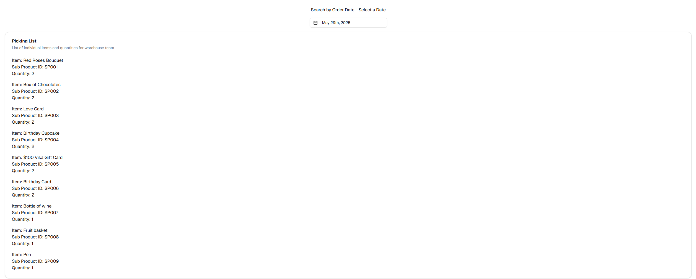
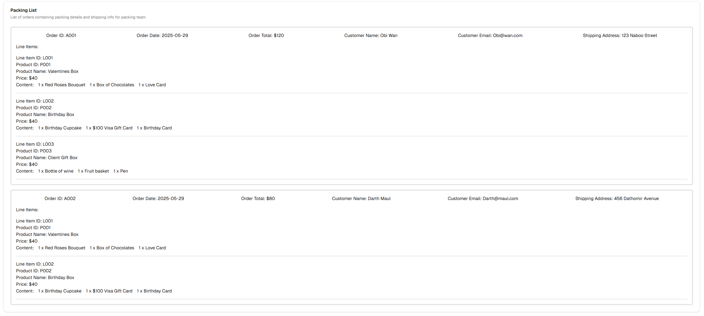
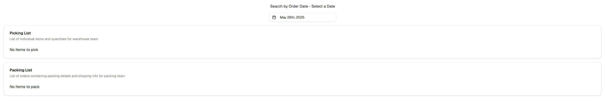

# Auto Warehouse
---
This Application will automatically generate the following:
- Picking List
- Packing List

### Note* 
Our Databases only contain data for May 27th, 2025 and May 29th, 2025

## Clone this Repo 

```bash
git clone https://github.com/brandontor/autowarehouse.git
```


## Install Dependencies

You will need NPM to install  dependencies

**Note** - This application utilizes [React Day Picker ver 8.10.1](https://www.npmjs.com/package/react-day-picker) and will throw a peer dependency error. 

You can resolve this by utilizing the **--force** flag when installing
```bash
cd autowarehouse
npm install --force
```

## Getting Started

First, run the development server:

```bash
npm run dev
```

Open [http://localhost:3000](http://localhost:3000) with your browser to see the result.

## Technology Stack 
- React.js 
- Next.js
- Tailwind
- ShadCN

Refer to package.json for versions.

## Using the app

Utilize the Date Picker to lookup orders based on their Order date. The Picking & Packing list will generate based on the returned orders.

### Picking List


### Packing List 


### No Orders 



